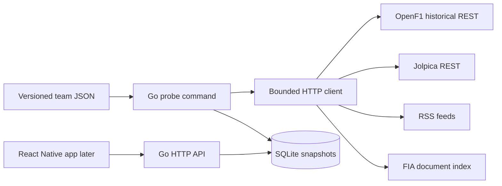
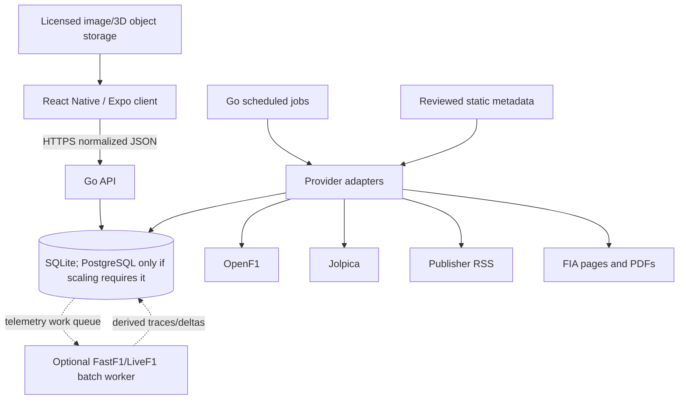

# Architecture

## Milestone 1

The mobile app never calls providers directly. The Go backend owns limits, attribution, normalization, caching, and provider changes. SQLite is embedded in the Go process and persisted through one Docker volume; a second “SQLite container” would be incorrect.

## Intended evolution

## Package boundaries

- `internal/fetch`: safe upstream HTTP transport.
- `internal/openf1`: typed OpenF1 ingestion client.
- `internal/probe`: source-specific validation and summaries.
- `internal/store`: SQLite schema, raw snapshots, and normalized persistence.
- `internal/server`: small HTTP surface.
- `cmd/probe`: explicit external integration smoke test.
- `cmd/sync`: explicit provider-to-normalized-database ingestion.
- `cmd/api`: database-backed client API.

Driver rosters, the complete OpenF1 meeting/session key registry, Jolpica events, event schedules, championship standings, and race classifications are normalized. All client API endpoints read only SQLite. Provider ownership is strict: Jolpica owns race/qualifying/sprint classifications and championships; OpenF1 owns practice details and timing/telemetry. Duplicate classifications are never merged. Raw snapshots remain diagnostic evidence. Next, add normalized articles, teams, upgrades, and asset provenance. Lap, sector, mini-sector, speed-trap, tyre-compound, stint, pit-stop, weather, race-control, overtake, position, interval, bounded track-location, and team-radio records are normalized per session. Team-radio audio is cached as SQLite blobs and streamed by the API with range support; clients never follow provider media URLs. An explicit `race_session_links` table connects Jolpica `(season, round)` races to OpenF1 race sessions; clients never guess this relationship from dates. The Race Hub aggregates local driver/lap statistics and returns a downsampled circuit trace generated from the synchronized lap with the best location coverage. A read-only session timeline composes low-frequency normalized tables with `UNION ALL`, orders them chronologically, and leaves high-volume location, car-data, and interval streams on dedicated endpoints. Bounded car telemetry is stored as idempotent timestamped samples and served with strict response limits. If full-season telemetry volume becomes a measured problem, migrate cold ranges to compressed chunks and retain derived/downsampled traces for mobile responses.
