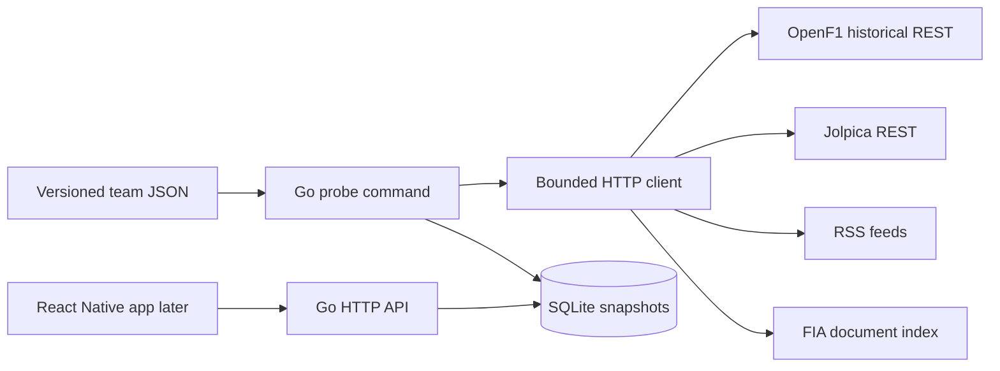
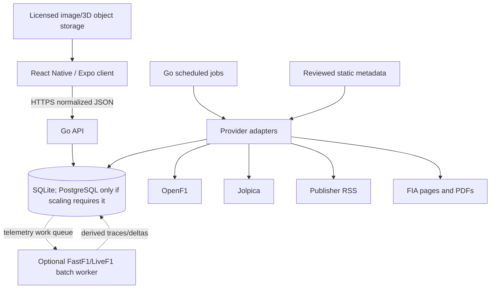

# Architecture

## Milestone 1

The mobile app never calls providers directly. The Go backend owns limits, attribution, normalization, caching, and provider changes. SQLite is embedded in the Go process and persisted through one Docker volume; a second “SQLite container” would be incorrect.

## Intended evolution

## Package boundaries

- `internal/fetch`: safe upstream HTTP transport.
- `internal/openf1`: typed OpenF1 ingestion client.
- `internal/probe`: source-specific validation and summaries.
- `internal/store`: SQLite schema, raw snapshots, and normalized persistence.
- `internal/server`: small HTTP surface.
- `cmd/probe`: explicit external integration smoke test.
- `cmd/sync`: explicit provider-to-normalized-database ingestion.
- `cmd/api`: database-backed client API.

Driver rosters, OpenF1 sessions, Jolpica events, event schedules, and both championship standings are normalized. All client API endpoints read only SQLite. Raw snapshots remain diagnostic evidence. Next, add normalized race results, articles, teams, upgrades, and asset provenance. High-frequency telemetry should use chunked compressed blobs or derived samples rather than one SQLite row per frame.
